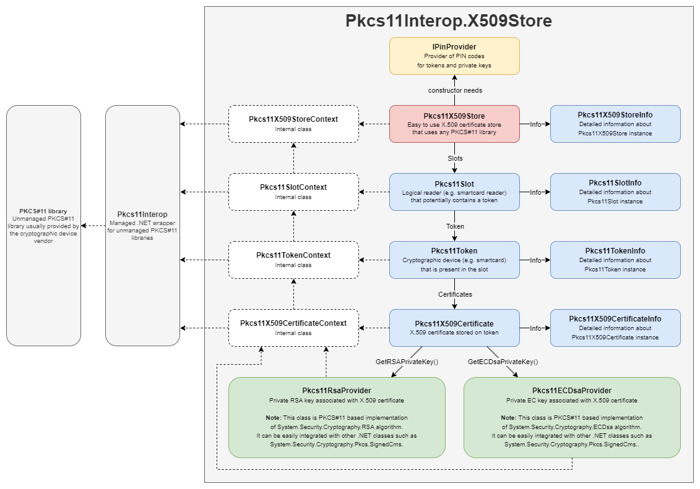

# Architecture of the Pkcs11Interop.X509Store library

The following figure represents the architecture of the `Pkcs11Interop.X509Store` library:

*Note: Click on a picture for a larger image.*

Here's a brief  explanation of the colors used for the individual items:
* The yellow item represents the `IPinProvider` interface, which you must implement yourself. It provides PIN codes needed to access PKCS#11 tokens and private keys. Your implementation can display a dialog window, console prompt, or read the PIN code from a configuration file.
* The red item represents the `Pkcs11X509Store` class, which serves as the main entry point of the `Pkcs11Interop.X509Store` library. You need to create an instance of this class and pass your implementation of the `IPinProvider` interface as a parameter.
* Blue items represent public read-only classes that provide information about slots/readers, tokens/cards, and certificates accessible via the PKCS#11 library. You directly interact with these classes to obtain information and present it to the user, etc.
* Green items represent classes that perform cryptographic operations with the keys stored on the token/card and seamlessly integrate with other parts of the .NET ecosystem. You directly interact with these classes if you want to perform signing/verification or encryption/decryption.
* White items represent classes with the internal implementation of the `Pkcs11Interop.X509Store` library. You do not interact with these classes directly unless you fork this project and work on a patch or a new feature.

[Next page >](03_GETTING_STARTED.md)